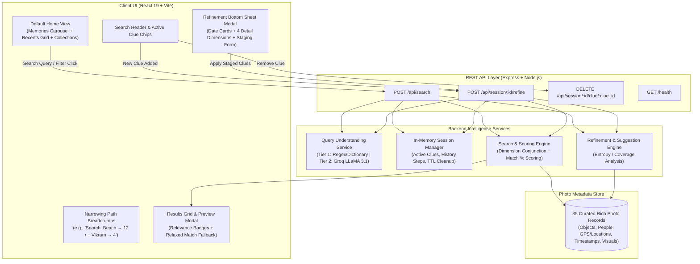

# Progressive Memory-Based Photo Search MVP — How It Works & Architecture Guide

## 1. Executive Summary & Why This Solution is Relevant

### 1.1 The Problem We Are Solving
In existing photo retrieval systems (including Google Photos, Apple Photos, and cloud storage search engines), finding a specific photo is treated as a **single-shot text lookup**. However, human memory of past events is **episodic, multi-dimensional, and progressive**. 

When users search for a photo, they rarely recall all metadata at once:
* They might remember an object or theme first: *"Sunflower with a bee"* or *"Beach trip"*.
* Seeing initial results triggers additional memories: *"Wait, it was during monsoon"*, *"Vikram was in the photo"*, *"It was a wide angle shot"*.

#### The Failure Point in Current Systems:
User research revealed that:
* **48.6% of search journeys end in search-recovery failure and abandonment**.
* When users add more keywords to an existing search query (e.g., typing *"Beach Vikram wide riding sunglasses 2024"*), search engines either return **zero results** (due to strict keyword misses) or **irrelevant noise**.
* Users are forced to guess *what keywords the engine wants* and *how to phrase them*, creating cognitive friction and frequent abandonment.

---

### 1.2 How Our Solution is Relevant
Our solution introduces a **Progressive Memory-Based Search Refinement Layer** that:
1. **Separates queries into distinct cognitive dimensions** (Who, Where, When, What happened, Objects, Visual style).
2. **Maintains search session state** across iterations so users never have to restart from scratch.
3. **Transparently exposes what the system understood** as removable, interactive filter chips.
4. **Dynamically recommends the highest-leverage next dimension** based on the current candidate photo pool to progressively narrow results (e.g. 200 photos → 42 photos → 5 photos → Target photo found).
5. **Guarantees Zero-Result Protection**: If a user adds a clue that yields 0 results, the system rejects the breaking filter, preserves the previous valid results, and alerts the user without breaking their search flow.
6. **Provides Relaxed Fallbacks & Match Percentages**: Clear relevance badges (e.g., `96% Match`, `88% Match`, or partial match fallback) give users immediate confidence.

```
                    ┌───────────────────────────────┐
                    │  Initial User Memory Fragment │
                    │     "Photos at the beach"     │
                    └───────────────┬───────────────┘
                                    │
                                    ▼
                    ┌───────────────────────────────┐
                    │ System parses: [Location:Beach]│
                    │      Returns 12 photos        │
                    └───────────────┬───────────────┘
                                    │
                    ┌───────────────┴───────────────┐
                    │ Dynamic Suggestions Prompt:   │
                    │ "Narrow by: 👤 Who? 📅 When?" │
                    └───────────────┬───────────────┘
                                    │
            User selects "Vikram"   │
                                    ▼
                    ┌───────────────────────────────┐
                    │ Combined Clues: Beach + Vikram│
                    │   Narrowing Path: 12 → 4      │
                    │    Result: Photo Found!       │
                    └───────────────────────────────┘
```

---

## 2. System Architecture & Component Breakdown



---

## 3. How the Default State Works

### 3.1 Home View Experience
When the user first opens the application without typing a search query, the interface mimics a modern Google Photos experience:
1. **Memories Carousel**:
   * Horizontally scrollable top cards featuring curated albums: *"Featured scenes (Sep – Nov 2024)"*, *"Best of October 2021"*, and *"Nagpur Over the years"*.
2. **Grouped Photo Grid**:
   * Displays all indexed photos from the user's library under a *"Recent"* header.
3. **Bottom Navigation**:
   * **Photos Tab**: Displays the standard photo feed.
   * **Collections Tab**: Groups library photos by tagged people with circular face avatars (e.g. Vikram, Naina, Sneha, Aarav, Priya). Clicking any person instantly triggers a filtered search for that individual.
4. **Floating Action Button (FAB)**:
   * A vibrant Google-themed Sparkles FAB (`✨`) that opens Search & Refinement mode with one tap.

### 3.2 Default Filter State (Empty Search)
When opening the Refinement panel without an active search query:
* **"Filter your search"**: Explains that users can select attributes directly without typing.
* **Top Dates**: Displays the most populated date clusters (e.g. *Winter 2024*, *Autumn 2024*, *Summer 2023*) with live photo thumbnails and photo count badges.
* **Detail Dimensions**: Provides instant entry into *What happened (Activity)*, *Where (Location)*, *Who (People)*, and *Objects*.

---

## 4. The 5 Core Memory Dimensions & Filter Mechanics

Our solution organizes memory into 5 distinct cognitive facets:

| Dimension | User Mental Model | Examples in Dataset | UI Representation |
|---|---|---|---|
| **📅 When (`time`)** | *"When did this happen?"* | `2024`, `2023`, `2021`, `winter`, `monsoon`, `summer`, `autumn` | Rich visual date cards with count, check badge, and pill filters |
| **📍 Where (`location`)** | *"Where was I?"* | `Goa`, `Beach`, `Mumbai`, `Nagpur`, `Mountain`, `Office`, `Cafe` | Location pill chip (`📍 Where: Goa`) with one-tap suggestions |
| **👤 Who (`person`)** | *"Who was with me?"* | `Vikram`, `Naina`, `Sneha`, `Aarav`, `Priya`, `Kabir` | People pill chip (`👤 Who: Vikram`) & avatar integration |
| **🏃 What Happened (`activity`)** | *"What were we doing?"* | `riding`, `meeting`, `party`, `trekking`, `dinner`, `celebration` | Activity pill chip (`🏃 What happened: riding`) |
| **📦 Objects & Visuals (`object` / `visual`)** | *"What objects or style do I recall?"* | `sunglasses`, `cake`, `bike`, `laptop`, `wide`, `close-up`, `warm` | Object & style chips (`📦 Object: sunglasses`) |

### How Filters Are Applied & Staged
1. **Quick Filters Toolbar**:
   * When an active search is in progress, the top horizontal toolbar displays active filters as interactive pills.
   * Clicking a category pill (e.g., `Date ▾`, `Location ▾`, `People ▾`) immediately opens the refinement panel scrolled to that specific dimension.
   * Clicking `(X)` on any active pill removes that clue and instantly recalculates the result set.
2. **Staging Multi-Filter Refinements**:
   * Inside the bottom sheet modal, users can select multiple cards across multiple dimensions (e.g., tap a date + tap a person + type an object) without triggering multiple round-trip reloads.
   * Staged filters appear as dashed blue chips (`+ Who: Vikram`, `+ Time: 2024`).
   * Clicking **"Show results"** executes atomic multi-filter refinement in a single user action.

---

## 5. Intelligent Query Understanding (Two-Tier Parsing)

To combine the speed of local heuristics with the semantic intelligence of Large Language Models, the backend employs a **two-tier parsing architecture**:

```
                              User Input String
                                     │
                    ┌────────────────┴────────────────┐
                    │ Has Valid GROQ_API_KEY (gsk_*)? │
                    └────────────────┬────────────────┘
                           NO        │        YES
             ┌───────────────────────┘        └───────────────────────┐
             ▼                                                        ▼
    ┌──────────────────────────────┐                         ┌──────────────────────────────┐
    │     TIER 1: LOCAL PARSER     │                         │   TIER 2: GROQ LLM PARSER    │
    │  - Fast dictionary matching  │                         │  - Model: llama-3.1-8b-instant│
    │  - Regex word boundary tests │                         │  - Temperature: 0.1 (Strict) │
    │  - Proper-noun capitalization│                         │  - JSON schema enforcement   │
    │  - Zero network latency      │                         │  - Deep semantic reasoning   │
    └──────────────┬───────────────┘                         └──────────────┬───────────────┘
                   │                                                        │
                   └────────────────────────┬───────────────────────────────┘
                                            ▼
                                Structured Clue Array
               [ { dimension: "location", value: "beach", confidence: 0.9 } ]
```

### 5.1 Tier 1: Local Dictionary & Regex Heuristic Parser
* **Keyword Matching**: Pre-configured high-confidence vocabulary mapping across all dimensions (e.g., `beach`, `office`, `cafe`, `birthday`, `meeting`, `monsoon`, `sunset`, `bike`).
* **Word Boundary Protection**: Prevents false positive substring matches using regex `\bterm\b`.
* **Proper-Noun Capitalization Detection**: Automatically identifies capitalized words not found in dictionary (e.g., names like *"Vikram"* or *"Pritish"*) and assigns them to the `person` dimension with preserved casing.

### 5.2 Tier 2: Groq LLaMA 3.1 8B Instant Parser
* Uses `llama-3.1-8b-instant` through Groq's high-speed inference engine.
* Parses unstructured, conversational natural language queries like *"show me photos of Vikram riding a bike at the beach during sunset"*.
* Outputs structured JSON objects specifying the exact `dimension`, `value`, and `confidence` score.

---

## 6. Search & Scoring Engine Mechanics

### 6.1 Dimension Conjunction & Disjunction Logic
The retrieval engine operates on structured clue objects:
1. **Clues are grouped by dimension**:
   $$\text{Dimensions} = \{ D_{\text{location}}, D_{\text{person}}, D_{\text{time}}, D_{\text{activity}}, D_{\text{object}} \}$$
2. **Conjunctive Matching across dimensions**:
   * A photo is an **Exact Match** if it satisfies **all active dimensions**.
3. **Disjunctive / Best Score within a dimension**:
   * If a dimension contains multiple clues, the photo receives the maximum score for that dimension:
   $$\text{Score}(D_i) = \max_{c \in D_i} \text{MatchQuality}(c, \text{photo})$$

### 6.2 Relevance Percentage Calculation
Every matched photo receives an explainable match percentage:
* **Exact Matches (all dimensions satisfied)**:
  $$\text{Match \%} = \min\left(99, \max\left(86, \text{round}\left(84 + (\text{AvgQuality} \times 14)\right)\right)\right)$$
  Displayed with an **Emerald / Green Sparkle Badge** (e.g., `96%`).
* **Partial / Relaxed Matches (subset of dimensions satisfied)**:
  $$\text{Match \%} = \min\left(75, \max\left(38, \text{round}\left(\frac{\text{DimsMatched}}{\text{TotalDims}} \times 50 + \text{AvgQuality} \times 20\right)\right)\right)$$
  Displayed with a **Blue / Amber Badge** (e.g., `68%`).

### 6.3 Relaxed Match Fallback
If the user's combination of clues produces zero exact matches across all dimensions:
* Instead of showing a blank screen, the engine returns **Relaxed Matches** sorted by:
  1. Number of matching dimensions descending.
  2. Match quality percentage descending.
* A clear notification informs the user: *"No exact matches found. Here are photos that match some of your filters."*

---

## 7. Zero-Result Protection Guardrail

A fundamental discovery from user research is that **unexpected zero-result states cause immediate search abandonment**. 

In our solution:
1. When a user adds a new clue, the backend simulates the new search.
2. If the new clue drops the count to **0 photos** (and prior results existed):
   * The backend **rejects the clue** and does not corrupt the session state.
   * The response returns `zero_results: true`, `rejected_clue: { value: "...", dimension: "..." }`, and keeps the previous valid result set intact.
   * The frontend displays a non-blocking toast warning:
     `"Adding '[clue]' removed all results. Kept previous search."`
   * The user is never left stranded on an empty screen.

---

## 8. Narrowing Path Breadcrumbs

To give the user a clear sense of progress and cognitive control, the search results page renders a real-time **Narrowing Path**:

$$\text{Search: "Beach"} \rightarrow 12 \quad \bullet \quad + \text{Vikram} \rightarrow 5 \quad \bullet \quad + \text{Wide} \rightarrow 1$$

* **Immediate feedback**: The user sees how each added memory clue contributed to narrowing the candidate set.
* **Session history**: Stored inside the session object's `refinement_history` array, capturing the exact `clues_state` and `result_count` at every step.

---

## 9. Dynamic Suggestion Ranking

When suggesting which filter to try next, the engine analyzes the remaining candidate photo pool:
1. It computes the coverage ratio for each unused dimension:
   $$\text{Coverage}(D) = \frac{\text{Count of candidate photos containing attribute } D}{\text{Total candidate photos in pool}}$$
2. Dimensions that effectively segment the pool without eliminating all photos are prioritized.
3. The suggestions list returns the most frequent values for each dimension (e.g., specific dates, places, people, or activities) ready for one-tap selection.

---

## 10. Summary of Key Files

| File | Purpose |
|---|---|
| [`backend/index.js`](file:///h:/Antigravity/Google%20Photo%20MVP/backend/index.js) | Express app setup, CORS, route mounting, health check |
| [`backend/src/routes/search.js`](file:///h:/Antigravity/Google%20Photo%20MVP/backend/src/routes/search.js) | Initial query search handler, session creator |
| [`backend/src/routes/refine.js`](file:///h:/Antigravity/Google%20Photo%20MVP/backend/src/routes/refine.js) | Progressive refinement endpoint, clue deletion, zero-result guard |
| [`backend/src/services/queryUnderstanding.js`](file:///h:/Antigravity/Google%20Photo%20MVP/backend/src/services/queryUnderstanding.js) | Two-tier query parser (Regex/Dictionary + Groq LLaMA 3.1) |
| [`backend/src/services/searchService.js`](file:///h:/Antigravity/Google%20Photo%20MVP/backend/src/services/searchService.js) | Conjunction search, clue matching, relevance scoring |
| [`backend/src/services/refinementEngine.js`](file:///h:/Antigravity/Google%20Photo%20MVP/backend/src/services/refinementEngine.js) | Suggestion generation and dimension ranking |
| [`backend/src/models/session.js`](file:///h:/Antigravity/Google%20Photo%20MVP/backend/src/models/session.js) | In-memory session store with refinement step history |
| [`backend/src/data/samplePhotos.json`](file:///h:/Antigravity/Google%20Photo%20MVP/backend/src/data/samplePhotos.json) | 35 sample photos with rich multidimensional metadata |
| [`frontend/src/App.jsx`](file:///h:/Antigravity/Google%20Photo%20MVP/frontend/src/App.jsx) | Complete interactive UI (home feed, collections, bottom sheet, filters, breadcrumbs) |
| [`frontend/src/services/api.js`](file:///h:/Antigravity/Google%20Photo%20MVP/frontend/src/services/api.js) | API client for search, refineSession, and removeClue |
