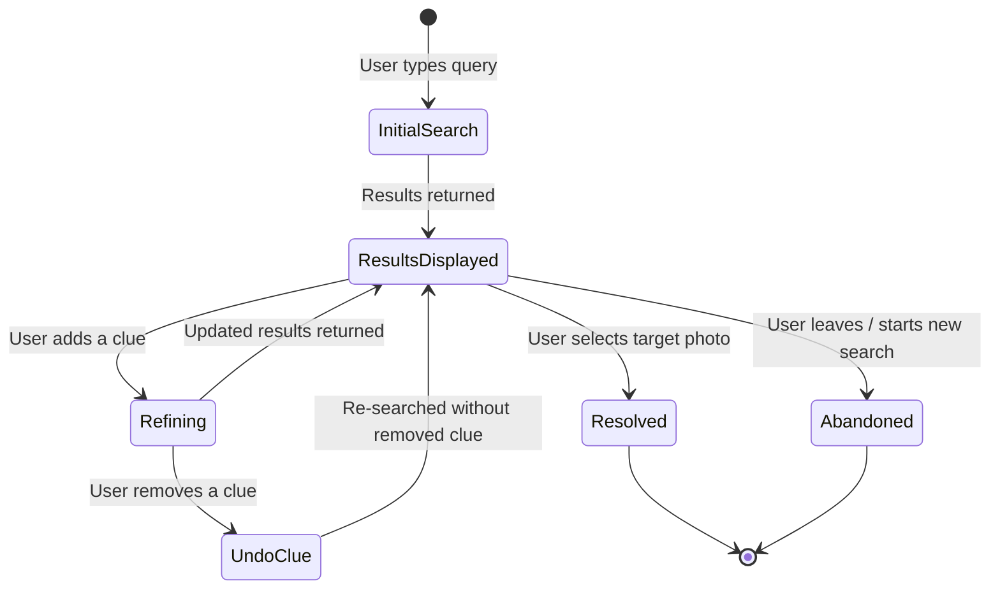

# Architecture — Progressive Memory-Based Search Refinement

> **Last updated:** 2026-10-03
> **Related:** [Problem Statement](file:///h:/Antigravity/Google%20Photo%20MVP/Document/Problem%20statemnat.txt) · [Context](file:///h:/Antigravity/Google%20Photo%20MVP/Document/context.md)

---

## 1. System Overview

The system extends Google Photos search with a **progressive refinement layer** that sits between the user and the existing search/retrieval backend. It intercepts queries, extracts structured memory clues, maintains a refinement session, and guides the user toward their target photo through iterative narrowing.

### High-Level Architecture

```
┌─────────────────────────────────────────────────────────────────────┐
│                          CLIENT (UI Layer)                          │
│                                                                     │
│  ┌──────────────┐  ┌──────────────────┐  ┌───────────────────────┐  │
│  │  Search Bar   │  │  Understanding   │  │  Refinement Panel     │  │
│  │  (Query Input)│  │  Display         │  │  (Dimension Chips +   │  │
│  │              │  │  (Parsed Clues)  │  │   NL Input)           │  │
│  └──────┬───────┘  └────────▲─────────┘  └──────────┬────────────┘  │
│         │                   │                       │                │
│         ▼                   │                       ▼                │
│  ┌──────────────────────────┴───────────────────────────────────┐    │
│  │                    Session State Manager                     │    │
│  │         (Active Clues, Refinement History, Results)          │    │
│  └──────────────────────────┬───────────────────────────────────┘    │
└─────────────────────────────┼───────────────────────────────────────┘
                              │
                     ─────────┼─────────
                    │   API Gateway     │
                     ─────────┼─────────
                              │
┌─────────────────────────────┼───────────────────────────────────────┐
│                        SERVER (Backend)                              │
│                              │                                      │
│  ┌───────────────────────────▼──────────────────────────────────┐    │
│  │                 Query Understanding Service                  │    │
│  │            (NLP Entity Extraction + Classification)          │    │
│  └───────────────────────────┬──────────────────────────────────┘    │
│                              │                                      │
│  ┌───────────────────────────▼──────────────────────────────────┐    │
│  │                  Refinement Engine                            │    │
│  │      (Clue Merging, Dimension Suggestion, Scoring)           │    │
│  └───────────────────────────┬──────────────────────────────────┘    │
│                              │                                      │
│  ┌───────────────────────────▼──────────────────────────────────┐    │
│  │                  Search & Retrieval Service                   │    │
│  │       (Photo Index, Metadata Store, Ranking Engine)           │    │
│  └──────────────────────────────────────────────────────────────┘    │
│                                                                     │
│  ┌──────────────────────────────────────────────────────────────┐    │
│  │                  Photo Metadata Store                         │    │
│  │   (Objects, Faces, Locations, Dates, Visual Attributes)      │    │
│  └──────────────────────────────────────────────────────────────┘    │
└─────────────────────────────────────────────────────────────────────┘
```

---

## 2. Core Components

### 2.1 Client Layer

| Component | Responsibility | Key Behaviors |
|---|---|---|
| **Search Bar** | Accepts the user's natural-language query | Standard text input; triggers initial search |
| **Understanding Display** | Shows what the system parsed from the query | Renders entity chips (🌻 Sunflower, 🐝 Bee) with remove/edit affordances |
| **Refinement Panel** | Guides the user to add the next clue | Shows dimension prompts (Who · Where · When · What happened · What it looked like); accepts free-text or structured input |
| **Results Grid** | Displays matching photos with result count | Updates in real time as clues are added/removed; shows narrowing progress (e.g., "200 → 42 photos") |
| **Session State Manager** | Client-side state orchestrator | Holds active clues, refinement history, undo stack, and cached results for the current search session |

### 2.2 Server Layer

| Component | Responsibility | Key Behaviors |
|---|---|---|
| **Query Understanding Service** | Two-tier parsing of natural-language input | Fast local parsing (regex/dictionary) first; Groq LLM API only used as fallback for complex queries |
| **Refinement Engine** | Merges new clues with existing session context and suggests next dimensions | Scores which unfilled dimension would narrow results most effectively |
| **Search & Retrieval Service** | Executes multi-clue searches against the photo index | Accepts a structured clue set (not just a raw string); returns ranked photos + result count |
| **Photo Metadata Store** | Stores per-photo indexed attributes | Objects, faces/people, GPS/location, timestamps, visual attributes (composition, color, angle) |

---

## 3. Data Models

### 3.1 Search Session

A search session persists across the entire refinement journey — from first query to photo found (or abandonment).

```json
{
  "session_id": "uuid-v4",
  "user_id": "user-abc",
  "created_at": "2026-10-03T15:00:00Z",
  "status": "active | resolved | abandoned",

  "clues": [
    {
      "clue_id": "clue-1",
      "dimension": "object",
      "value": "sunflower",
      "source": "initial_query",
      "added_at": "2026-10-03T15:00:00Z",
      "active": true
    },
    {
      "clue_id": "clue-2",
      "dimension": "creature",
      "value": "bee",
      "source": "initial_query",
      "added_at": "2026-10-03T15:00:00Z",
      "active": true
    },
    {
      "clue_id": "clue-3",
      "dimension": "location",
      "value": "farm",
      "source": "refinement_step",
      "added_at": "2026-10-03T15:00:32Z",
      "active": true
    }
  ],

  "refinement_history": [
    {
      "step": 0,
      "clue_ids": ["clue-1", "clue-2"],
      "result_count": 200,
      "timestamp": "2026-10-03T15:00:01Z"
    },
    {
      "step": 1,
      "clue_ids": ["clue-1", "clue-2", "clue-3"],
      "result_count": 42,
      "timestamp": "2026-10-03T15:00:33Z"
    }
  ],

  "suggested_dimensions": ["person", "time", "visual_attribute"],
  "resolved_photo_id": null
}
```

### 3.2 Clue Object

Each piece of user memory is represented as a typed clue:

```json
{
  "clue_id": "string",
  "dimension": "object | person | location | time | activity | visual_attribute",
  "value": "string (natural-language fragment)",
  "normalized_value": "string (system-resolved canonical form)",
  "confidence": 0.0 - 1.0,
  "source": "initial_query | refinement_step | system_suggestion",
  "active": true,
  "added_at": "ISO-8601 timestamp"
}
```

### 3.3 Memory Dimension Taxonomy

```
┌────────────────────────────────────────────────────────┐
│                  MEMORY DIMENSIONS                      │
├──────────────┬─────────────────────────────────────────┤
│  Dimension   │  Maps to Photo Metadata                 │
├──────────────┼─────────────────────────────────────────┤
│  WHO         │  Face recognition, people tags           │
│  WHERE       │  GPS coordinates, location labels        │
│  WHEN        │  Timestamp, season inference, events     │
│  WHAT (obj)  │  Object detection labels                 │
│  ACTIVITY    │  Scene classification, event tags         │
│  VISUAL      │  Composition, angle, color, close-up     │
└──────────────┴─────────────────────────────────────────┘
```

---

## 4. Data Flow — End-to-End

### 4.1 Sequence Diagram

```
 User              Client UI           API Gateway      Query Understanding    Refinement Engine    Search Service
  │                    │                    │                    │                    │                    │
  │  1. Type query     │                    │                    │                    │                    │
  │ ──────────────────>│                    │                    │                    │                    │
  │                    │  2. POST /search   │                    │                    │                    │
  │                    │ ──────────────────>│                    │                    │                    │
  │                    │                    │  3. Parse query    │                    │                    │
  │                    │                    │ ──────────────────>│                    │                    │
  │                    │                    │                    │                    │                    │
  │                    │                    │  4. Extracted      │                    │                    │
  │                    │                    │     clues          │                    │                    │
  │                    │                    │ <──────────────────│                    │                    │
  │                    │                    │                    │                    │                    │
  │                    │                    │  5. Create session + get suggestions   │                    │
  │                    │                    │ ──────────────────────────────────────>│                    │
  │                    │                    │                    │                    │                    │
  │                    │                    │  6. Session +      │                    │                    │
  │                    │                    │     suggested dims │                    │                    │
  │                    │                    │ <──────────────────────────────────────│                    │
  │                    │                    │                    │                    │                    │
  │                    │                    │  7. Execute search with clue set       │                    │
  │                    │                    │ ─────────────────────────────────────────────────────────>│
  │                    │                    │                    │                    │                    │
  │                    │                    │  8. Ranked photos  │                    │                    │
  │                    │                    │     + count        │                    │                    │
  │                    │                    │ <─────────────────────────────────────────────────────────│
  │                    │                    │                    │                    │                    │
  │                    │  9. Response:      │                    │                    │                    │
  │                    │     clues + photos │                    │                    │                    │
  │                    │     + suggestions  │                    │                    │                    │
  │                    │ <──────────────────│                    │                    │                    │
  │                    │                    │                    │                    │                    │
  │  10. Display:      │                    │                    │                    │                    │
  │  - Understood      │                    │                    │                    │                    │
  │  - Results (200)   │                    │                    │                    │                    │
  │  - "What else?"    │                    │                    │                    │                    │
  │ <──────────────────│                    │                    │                    │                    │
  │                    │                    │                    │                    │                    │
  │  11. Add clue:     │                    │                    │                    │                    │
  │  "at a farm"       │                    │                    │                    │                    │
  │ ──────────────────>│                    │                    │                    │                    │
  │                    │  12. POST /refine  │                    │                    │                    │
  │                    │ ──────────────────>│                    │                    │                    │
  │                    │                    │  13. Parse new clue│                    │                    │
  │                    │                    │ ──────────────────>│                    │                    │
  │                    │                    │ <──────────────────│                    │                    │
  │                    │                    │  14. Merge clue +  │                    │                    │
  │                    │                    │      re-suggest    │                    │                    │
  │                    │                    │ ──────────────────────────────────────>│                    │
  │                    │                    │ <──────────────────────────────────────│                    │
  │                    │                    │  15. Re-search     │                    │                    │
  │                    │                    │ ─────────────────────────────────────────────────────────>│
  │                    │                    │ <─────────────────────────────────────────────────────────│
  │                    │                    │                    │                    │                    │
  │                    │  16. Updated:      │                    │                    │                    │
  │                    │  clues + 42 photos │                    │                    │                    │
  │                    │  + new suggestions │                    │                    │                    │
  │                    │ <──────────────────│                    │                    │                    │
  │                    │                    │                    │                    │                    │
  │  17. Display:      │                    │                    │                    │                    │
  │  updated results   │                    │                    │                    │                    │
  │  (200 → 42)        │                    │                    │                    │                    │
  │ <──────────────────│                    │                    │                    │                    │
```

### 4.2 Flow Phases

The data flow happens in **three distinct phases** that repeat until the photo is found:

---

#### Phase 1 — Initial Search

```
┌──────────┐     ┌────────────────────┐     ┌───────────────────┐     ┌──────────────┐
│  User    │     │  Query             │     │  Refinement       │     │  Search      │
│  types   │────>│  Understanding     │────>│  Engine           │────>│  Service     │
│  query   │     │                    │     │                    │     │              │
└──────────┘     │  IN:  raw string   │     │  IN:  clues[]     │     │  IN:  clues[]│
                 │  OUT: clues[]      │     │  OUT: session,    │     │  OUT: photos,│
                 │       + confidence │     │       suggestions │     │       count  │
                 └────────────────────┘     └───────────────────┘     └──────────────┘
```

**Data transformations:**

| Step | Input | Output | Transformation |
|---|---|---|---|
| **Parse** | `"Sunflower with a bee sitting on it"` | `[{dim: "object", val: "sunflower"}, {dim: "creature", val: "bee"}]` | NLP entity extraction + dimension classification |
| **Session init** | `clues[]` | `session{clues, suggested_dims}` | Create session; analyze which dimensions are missing; score dimension utility |
| **Search** | `clues[]` | `photos[], count: 200` | Multi-attribute query against photo index |

---

#### Phase 2 — Understanding Display + Prompting

```
┌──────────────────────────────────────────────────┐
│                  CLIENT RENDERING                 │
│                                                   │
│  ┌─────────────────────────────────────────────┐  │
│  │  "I understood:"                            │  │
│  │  [🌻 Sunflower] [🐝 Bee]                    │  │
│  │                              (removable)    │  │
│  └─────────────────────────────────────────────┘  │
│                                                   │
│  ┌─────────────────────────────────────────────┐  │
│  │  "200 photos found"                         │  │
│  └─────────────────────────────────────────────┘  │
│                                                   │
│  ┌─────────────────────────────────────────────┐  │
│  │  "What else do you remember?"               │  │
│  │                                             │  │
│  │  [👤 Who] [📍 Where] [📅 When]              │  │
│  │  [🎯 What happened] [🖼️ What it looked like]│  │
│  │                                             │  │
│  │  ┌─────────────────────────────────────┐    │  │
│  │  │  Type a clue...                     │    │  │
│  │  └─────────────────────────────────────┘    │  │
│  └─────────────────────────────────────────────┘  │
│                                                   │
│  ┌─────────────────────────────────────────────┐  │
│  │  [Photo Grid — 200 results]                 │  │
│  └─────────────────────────────────────────────┘  │
└──────────────────────────────────────────────────┘
```

**No network call** — this is pure client-side rendering from the initial response payload.

---

#### Phase 3 — Refinement Loop (Repeats)

```
User adds clue → Parse → Merge into session → Re-search → Update UI
     │                                                         │
     │              ┌──────────────────────────┐               │
     │              │   Can the user UNDO?     │               │
     │              │   YES — remove last clue │               │
     │              │   and re-search          │               │
     │              └──────────────────────────┘               │
     │                                                         │
     └──── Loop until: result_count ≤ threshold ───────────────┘
                        OR user selects a photo
                        OR user abandons
```

**Data flow per refinement step:**

```json
// REQUEST — POST /api/session/{session_id}/refine
{
  "new_clue_text": "at a farm",
  "dimension_hint": "location"     // optional, from dimension chip
}

// RESPONSE
{
  "session": {
    "clues": [ /* updated full list */ ],
    "refinement_history": [ /* appended entry */ ],
    "suggested_dimensions": ["person", "time", "visual_attribute"]
  },
  "results": {
    "photos": [ /* ranked photo objects */ ],
    "total_count": 42,
    "previous_count": 200
  },
  "understanding": {
    "new_clue_parsed": {
      "dimension": "location",
      "value": "farm",
      "confidence": 0.92
    }
  }
}
```

---

## 5. API Contract

### 5.1 Endpoints

| Method | Endpoint | Purpose |
|---|---|---|
| `POST` | `/api/search` | Initial search — creates session + returns first results |
| `POST` | `/api/session/{id}/refine` | Add a new clue to an existing session |
| `DELETE` | `/api/session/{id}/clue/{clue_id}` | Remove a clue (undo) and re-search |
| `GET` | `/api/session/{id}` | Retrieve current session state |
| `PATCH` | `/api/session/{id}/resolve` | Mark session as resolved (photo found) |
| `GET` | `/api/session/{id}/suggestions` | Get recommended next dimensions |

### 5.2 Initial Search — `POST /api/search`

```json
// REQUEST
{
  "query": "sunflower with a bee sitting on it",
  "user_id": "user-abc"
}

// RESPONSE
{
  "session_id": "sess-xyz",
  "understanding": {
    "clues": [
      { "clue_id": "c1", "dimension": "object", "value": "sunflower", "confidence": 0.97 },
      { "clue_id": "c2", "dimension": "creature", "value": "bee", "confidence": 0.94 }
    ],
    "unrecognized_fragments": ["sitting on it"]
  },
  "results": {
    "photos": [ { "photo_id": "p1", "thumbnail_url": "...", "score": 0.91 } ],
    "total_count": 200
  },
  "suggestions": {
    "prompt": "What else do you remember?",
    "dimensions": [
      { "key": "person",           "label": "Who",                "icon": "👤", "estimated_reduction": 0.72 },
      { "key": "location",         "label": "Where",              "icon": "📍", "estimated_reduction": 0.65 },
      { "key": "time",             "label": "When",               "icon": "📅", "estimated_reduction": 0.58 },
      { "key": "activity",         "label": "What happened",      "icon": "🎯", "estimated_reduction": 0.41 },
      { "key": "visual_attribute", "label": "What it looked like", "icon": "🖼️", "estimated_reduction": 0.37 }
    ]
  }
}
```

> `estimated_reduction` — a 0–1 score indicating how much adding a clue in this dimension would likely narrow the current result set. Higher = more impactful. This drives dimension ordering in the UI.

### 5.3 Refinement — `POST /api/session/{id}/refine`

```json
// REQUEST
{
  "new_clue_text": "my sister was there",
  "dimension_hint": "person"
}

// RESPONSE — same shape as initial search response, with updated session
```

### 5.4 Undo — `DELETE /api/session/{id}/clue/{clue_id}`

```json
// RESPONSE
{
  "removed_clue": { "clue_id": "c3", "dimension": "location", "value": "farm" },
  "results": { /* re-searched without this clue */ },
  "suggestions": { /* re-calculated */ }
}
```

---

## 6. State Machine — Search Session Lifecycle



### State Definitions

| State | Description | Transitions |
|---|---|---|
| **InitialSearch** | Query sent; waiting for response | → ResultsDisplayed |
| **ResultsDisplayed** | Photos shown; understanding visible; refinement panel active | → Refining, Resolved, Abandoned |
| **Refining** | New clue submitted; waiting for updated results | → ResultsDisplayed |
| **UndoClue** | Clue removed; re-searching | → ResultsDisplayed |
| **Resolved** | User found and selected the target photo | → End |
| **Abandoned** | User left without finding the photo | → End |

---

## 7. Refinement Engine — Dimension Suggestion Algorithm

The Refinement Engine is the **key differentiator**. It answers: *"Which dimension should the user fill next?"*

### 7.1 Scoring Model

For each unfilled dimension `d`, compute:

```
score(d) = α · entropy_reduction(d)
         + β · fill_rate(d)
         + γ · user_memory_likelihood(d)
```

| Factor | Weight | What It Measures |
|---|---|---|
| `entropy_reduction(d)` | α = 0.5 | How much adding a clue in dimension `d` would narrow the current result set (estimated from metadata distribution) |
| `fill_rate(d)` | β = 0.3 | What % of photos in the result set have metadata in dimension `d` (higher = more filterable) |
| `user_memory_likelihood(d)` | γ = 0.2 | Prior probability that a user remembers this dimension (from research: people > location > time > activity > visual) |

### 7.2 Example Calculation

After initial search returns 200 sunflower+bee photos:

| Dimension | entropy_reduction | fill_rate | memory_likelihood | **Score** |
|---|---|---|---|---|
| person | 0.80 | 0.65 | 0.90 | **0.77** |
| location | 0.70 | 0.72 | 0.75 | **0.72** |
| time | 0.60 | 0.95 | 0.60 | **0.71** |
| activity | 0.40 | 0.30 | 0.45 | **0.38** |
| visual | 0.35 | 0.20 | 0.40 | **0.32** |

→ UI shows dimensions ordered: **Who → Where → When → What happened → What it looked like**

---

## 8. Data Pipeline — Photo Metadata Indexing

For progressive refinement to work, each photo must have rich, multi-dimensional metadata:

```
┌──────────────┐     ┌───────────────────────────────────────┐     ┌──────────────┐
│  Photo       │     │         ML Processing Pipeline        │     │  Metadata    │
│  Upload      │────>│                                       │────>│  Store       │
│              │     │  ┌─────────────┐  ┌───────────────┐   │     │              │
│              │     │  │ Object      │  │ Face          │   │     │  Per-photo   │
│              │     │  │ Detection   │  │ Recognition   │   │     │  indexed     │
│              │     │  └─────────────┘  └───────────────┘   │     │  attributes  │
│              │     │  ┌─────────────┐  ┌───────────────┐   │     │              │
│              │     │  │ Scene       │  │ Location      │   │     │              │
│              │     │  │ Classif.    │  │ Resolution    │   │     │              │
│              │     │  └─────────────┘  └───────────────┘   │     │              │
│              │     │  ┌─────────────┐  ┌───────────────┐   │     │              │
│              │     │  │ Visual      │  │ Temporal      │   │     │              │
│              │     │  │ Attributes  │  │ Extraction    │   │     │              │
│              │     │  └─────────────┘  └───────────────┘   │     │              │
└──────────────┘     └───────────────────────────────────────┘     └──────────────┘
```

### Metadata Schema per Photo

```json
{
  "photo_id": "p-12345",
  "objects": ["sunflower", "bee", "grass"],
  "people": ["sister (face-id-789)"],
  "location": {
    "gps": { "lat": 18.52, "lng": 73.85 },
    "label": "Sunflower Farm, Pune",
    "type": "outdoor/farm"
  },
  "timestamp": {
    "captured_at": "2025-07-15T10:32:00Z",
    "season": "monsoon",
    "time_of_day": "morning"
  },
  "scene": "nature/agriculture",
  "visual_attributes": {
    "composition": "close-up",
    "dominant_colors": ["yellow", "green"],
    "orientation": "portrait",
    "quality_score": 0.85
  }
}
```

---

## 9. Component Interaction Map

```
┌─────────────────────────────────────────────────────────────────────────────────┐
│                                                                                 │
│    USER ACTION                    SYSTEM RESPONSE                               │
│    ───────────                    ───────────────                               │
│                                                                                 │
│    ① Type query ─────────────> Parse → Search → Return results + clues          │
│                                                     │                           │
│                                                     ▼                           │
│    ② See understanding ◄────── Display: "I understood: 🌻 Sunflower, 🐝 Bee"   │
│       + result count            "Found 200 photos"                              │
│                                                     │                           │
│                                                     ▼                           │
│    ③ See dimension ◄────────── "What else do you remember?"                     │
│       suggestions               Who · Where · When · Activity · Visual          │
│                                                     │                           │
│                                                     │                           │
│    ④ Tap "Where" chip           │                                               │
│       or type "at a farm" ────> Parse → Merge clue → Re-search                  │
│                                                     │                           │
│                                                     ▼                           │
│    ⑤ See updated results ◄──── "200 → 42 photos"                               │
│       + updated clues           [🌻] [🐝] [📍 Farm]                             │
│       + new suggestions         Now suggests: Who · When · Visual               │
│                                                     │                           │
│                                                     │                           │
│    ⑥ Continue adding ──────>   Repeat ④–⑤ until found                          │
│       OR undo a clue ──────>   Remove clue → Re-search → Update                │
│       OR select photo ─────>   Mark resolved → End session                      │
│       OR leave ────────────>   Mark abandoned → End session                     │
│                                                                                 │
└─────────────────────────────────────────────────────────────────────────────────┘
```

---

## 10. Error Handling & Edge Cases

| Scenario | System Behavior | User Experience |
|---|---|---|
| **Query yields 0 results** | Skip refinement; suggest broadening the query | "No photos matched. Try a simpler description." |
| **Added clue reduces to 0** | Auto-revert the clue; keep previous results | "Adding 'beach' removed all results. I've kept your previous search." (Forgiveness principle) |
| **Ambiguous clue** | Return top interpretation with alternatives | "Did you mean 📍 Farm (location) or 🎯 Farming (activity)?" |
| **Duplicate clue** | Ignore silently; highlight existing chip | Existing chip pulses briefly |
| **Session timeout** | Preserve session for 30 minutes; allow resume | "Welcome back. You were looking for…" |
| **Low-confidence parse** | Add clue but flag uncertainty | Clue chip shows dotted border: `[📍 Farm?]` |

---

## 11. Technology Considerations

| Layer | Technology Options | Notes |
|---|---|---|
| **Frontend** | React / Angular (existing GP stack) | Component-based; real-time state updates |
| **State management** | Client-side session store (Redux / Zustand) | Undo stack, clue history, optimistic updates |
| **API** | REST or gRPC | REST for MVP; gRPC for production performance |
| **Query Understanding** | Regex/Dict + Groq API fallback | Hybrid approach: Local heuristic parsing saves cost/latency; LLM used only when needed |
| **Search Index** | Existing Google Photos search infra | Extended to accept structured multi-clue queries |
| **Dimension Scoring** | Lightweight ML model or heuristic | Can start with heuristic; upgrade to ML later |
| **Analytics** | Event logging per refinement step | Feeds success metrics (retrieval rate, abandonment, etc.) |

---

## 12. MVP Scope vs. Full Vision

| Capability | MVP (Phase 1) | Full Vision (Phase 2+) |
|---|---|---|
| Query parsing | Basic entity extraction (objects, people, places) | Full NL understanding with context |
| Understanding display | Show parsed entities as chips | Conversational feedback ("I see a sunflower and a bee…") |
| Dimension suggestions | Static list (Who/Where/When/Activity/Visual) | Dynamically scored + ordered by impact |
| Refinement input | Free-text input per dimension | Auto-complete, smart suggestions from photo metadata |
| Undo | Remove last clue | Full clue history with selective undo |
| Session persistence | In-memory (single browser session) | Server-side; cross-device resume |
| Analytics | Basic event logging | Full funnel analysis + model training feedback loop |
