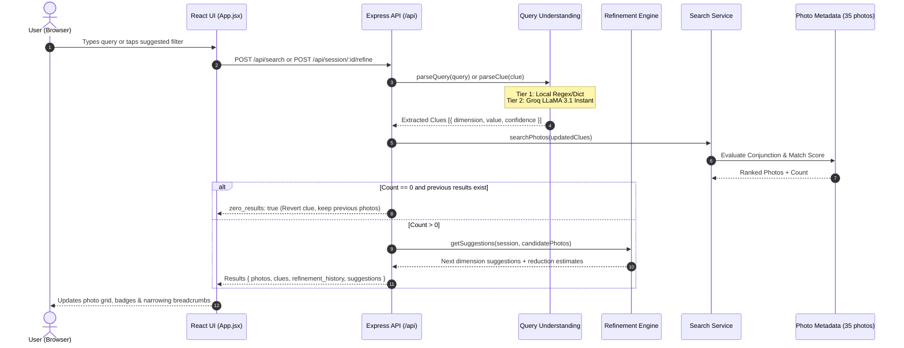

# Google Photos MVP — Progressive Memory-Based Search Refinement

[](https://react.dev/)
[](https://vitejs.dev/)
[](https://nodejs.org/)
[](https://expressjs.com/)
[](https://groq.com/)
[](https://opensource.org/licenses/MIT)

> **A next-generation photo discovery interface that bridges the gap between human episodic memory and photo search through progressive, multi-dimensional refinement.**

---

## 📌 Table of Contents
- [Executive Overview](#-executive-overview)
- [The Problem We Are Solving](#-the-problem-we-are-solving)
- [How Our Solution Works](#-how-our-solution-works)
- [Core Features](#-core-features)
- [Architecture & Data Flow](#-architecture--data-flow)
- [The 5 Memory Dimensions](#-the-5-memory-dimensions)
- [Two-Tier Query Understanding](#-two-tier-query-understanding)
- [Zero-Result Protection & Scoring](#-zero-result-protection--scoring)
- [Repository Structure](#-repository-structure)
- [Getting Started Locally](#-getting-started-locally)
- [API Reference](#-api-reference)
- [Testing & Quality Assurance](#-testing--quality-assurance)
- [Documentation & Deep Dives](#-documentation--deep-dives)

---

## 🚀 Executive Overview

Traditional photo search treats retrieval as a **single-shot keyword lookup**. When a user cannot remember all details up front, they search with a vague query (e.g. *"beach"*), get dozens or hundreds of photos, and are left with no intuitive way to refine the search using additional memories (e.g., *"with Vikram"*, *"in 2024"*, *"wearing sunglasses"*).

This MVP introduces a **Progressive Memory-Based Search Refinement Engine** that:
1. **Parses queries into distinct cognitive dimensions** (*Who*, *Where*, *When*, *What happened*, *Objects*, *Visual style*).
2. **Maintains stateful search sessions** that track active clues and narrowing history.
3. **Exposes intuitive filter chips and visual suggestion cards** with live photo previews.
4. **Protects against dead ends**: Never leaves the user on a zero-result page if an added filter breaks the search.
5. **Provides explainable relevance scores** (e.g., `96% Relevance Match` badge) and relaxed match fallbacks.

👉 **In-Depth Guide:** Read the full architectural walkthrough in [**HOW_THE_MVP_WORKS.md**](file:///h:/Antigravity/Google%20Photo%20MVP/Document/HOW_THE_MVP_WORKS.md).

---

## 🧠 The Problem We Are Solving

Our discovery research on photo search journeys identified that:
* **48.6% of search journeys end in search-recovery failure and abandonment**.
* Finding a specific photo is rarely a one-query task. Users remember photos in fragments.
* When users add extra keywords to existing search boxes (e.g., typing *"sunflower bee farm sister monsoon"*), standard engines either crash into zero results or lose context.

### The Solution Mental Model:
```text
Initial Memory: "Beach photos"
      ↓
Search: 12 photos found
      ↓
Dynamic Prompt: "What else do you remember? (Who, When, What happened)"
      ↓
User taps: "+ Vikram"
      ↓
Narrowing Path: 12 → 4 photos
      ↓
User taps: "+ Riding"
      ↓
Target photo found! (1 photo, 98% Match)
```

---

## ✨ Core Features

### 1. Default Google Photos Home Feed
* **Memories Carousel**: Curated album cards (*"Featured scenes"*, *"Best of October 2021"*, *"Nagpur Over the years"*).
* **Recent Photos Feed**: Responsive photo grid with full-screen preview modal and metadata tags.
* **Collections Navigation**: Tab to view photo collections grouped by person face avatars (Vikram, Naina, Sneha, Aarav, Priya). Clicking any person immediately launches a filtered search.
* **Sparkle Action Button (`✨`)**: Fast transition into progressive search mode.

### 2. Interactive Refinement Bottom Sheet
* **Try a Date**: Dynamic scrollable cards showing top date clusters (e.g., *Winter 2024*, *Summer 2023*) with live photo thumbnails and counts.
* **Add More Details**: 4 interactive categories (*What happened*, *Where*, *Who*, *Objects*) that reveal one-tap suggestions with candidate frequencies.
* **Multi-Filter Staging**: Users can stage multiple filters across categories and apply them atomically via the *"Show results"* action.
* **Active Clue Management**: All applied filters appear as chips with an `(X)` affordance for one-click removal and instant re-ranking.

### 3. Narrowing Path Breadcrumbs
* Displays a real-time progress trail above search results:
  `Search: "Beach" → 12 • + Vikram → 4 • + Riding → 1`
* Gives users transparency and confidence over how each clue affected candidate reduction.

### 4. Zero-Result Protection Guardrail
* If adding a clue drops the candidate set to 0 photos, the system **rejects the catastrophic clue**, preserves the prior valid results, and displays a friendly warning:
  `"Adding '[clue]' removed all results. Kept previous search."`

### 5. Explainable Relevance Scoring & Badges
* **High Relevance (90%+)**: Emerald badge with sparkle icon (`96%`).
* **Medium Relevance (75%–89%)**: Blue relevance badge (`82%`).
* **Relaxed Match Fallback**: When no photo satisfies all active dimensions simultaneously, the engine automatically surfaces photos that match the highest number of criteria with a clear partial match badge.

---

## 🏗️ Architecture & Data Flow



---

## 🏷️ The 5 Memory Dimensions

| Dimension | Key | Examples |
|---|---|---|
| **📅 When** | `time` | `2024`, `2023`, `2021`, `winter`, `monsoon`, `summer`, `autumn` |
| **📍 Where** | `location` | `Goa`, `Beach`, `Mumbai`, `Nagpur`, `Mountain`, `Cafe`, `Office` |
| **👤 Who** | `person` | `Vikram`, `Naina`, `Sneha`, `Aarav`, `Priya`, `Kabir` |
| **🏃 What Happened** | `activity` | `riding`, `meeting`, `party`, `trekking`, `dinner`, `celebration` |
| **📦 Objects & Visuals** | `object`, `visual` | `sunglasses`, `cake`, `bike`, `laptop`, `wide`, `close-up`, `warm` |

---

## ⚡ Two-Tier Query Understanding

To achieve high responsiveness and avoid unnecessary API cost or latency:
1. **Tier 1 (Local Regex & Keyword Parser)**:
   * Instant local lookup using word-boundary regex (`\bterm\b`).
   * Dictionary covering all common people, places, times, activities, and visual attributes.
   * Capitalized proper-noun detector for user and place names.
2. **Tier 2 (Groq LLaMA 3.1 8B Instant Fallback)**:
   * Activated when a valid `GROQ_API_KEY` (prefix `gsk_`) is configured and the query contains complex natural language syntax.
   * Runs at sub-second speeds on Groq LPUs with strict JSON schema response mode.

---

## 📁 Repository Structure

```
google_photo_mvp/
├── README.md                      # Primary project documentation (this file)
├── HOW_THE_MVP_WORKS.md           # Deep-dive architecture & walkthrough document
├── firebase.json                  # Firebase hosting configuration
├── .gitignore                     # Git ignore rules (node_modules, .env, dist)
│
├── backend/                       # Node.js + Express backend service
│   ├── index.js                   # Server entry point, CORS, routes & error handling
│   ├── package.json               # Backend dependencies (express, cors, dotenv)
│   ├── .env.example               # Backend environment variables template
│   ├── src/
│   │   ├── routes/
│   │   │   ├── search.js          # POST /api/search (initial query handler)
│   │   │   ├── refine.js          # POST /api/session/:id/refine & DELETE clue
│   │   │   └── session.js         # Session status inspection routes
│   │   ├── services/
│   │   │   ├── queryUnderstanding.js # Two-tier parser (Regex + Groq LLaMA 3.1)
│   │   │   ├── searchService.js   # Multi-clue conjunctive search & scoring
│   │   │   └── refinementEngine.js# Dynamic suggestion ranking & coverage
│   │   ├── models/
│   │   │   └── session.js         # In-memory session store & TTL manager
│   │   └── data/
│   │       └── samplePhotos.json  # 35 indexed sample photos with rich metadata
│   └── tests/                     # Backend automated unit & integration tests
│       ├── test_logic.js          # Core parsing & search logic unit test
│       ├── test_search.js         # Conjunction search unit test
│       ├── test_search2.js        # Search casing & multi-clue verification
│       ├── test_llm.js            # LLM query parser test
│       ├── test_beaches.js        # API integration test for beach queries
│       ├── test_all_filters.js    # Comprehensive multi-filter API test
│       └── test_fuzzy.js          # Typo & fallback parsing test
│
├── frontend/                      # React 19 + Vite frontend application
│   ├── index.html                 # HTML root
│   ├── package.json               # Frontend dependencies (react, lucide-react, vite)
│   ├── vite.config.js             # Vite build configuration
│   ├── .env.example               # Frontend environment template (VITE_API_URL)
│   ├── .env.production            # Production backend URL
│   └── src/
│       ├── App.jsx                # Main application component & layout states
│       ├── index.css              # Custom responsive styles & animations
│       └── services/
│           └── api.js             # API client (search, refineSession, removeClue)
│
├── Document/                      # Research, product requirements & specifications
│   ├── HOW_THE_MVP_WORKS.md       # In-depth architectural & filter explanation
│   ├── Problem statemnat.txt      # Problem statement & interview discovery data
│   ├── architecture.md            # System architecture specification
│   ├── context.md                 # User research & journey analysis
│   ├── edgecase.md                # Edge case specifications
│   ├── evalv.md                   # Evaluation framework
│   └── implementation.md          # Technical implementation guide
│
└── scripts/                       # Asset and maintenance helper utilities
    ├── copy_beach.js
    ├── copy_images.js
    ├── fixImages.js
    └── fix_project_folders.js
```

---

## 🛠️ Getting Started Locally

### Prerequisites
* **Node.js**: v18.0.0 or higher
* **npm**: v9.0.0 or higher
* *(Optional)*: Groq API Key (`GROQ_API_KEY`) for AI-powered natural language queries.

---

### Step 1: Clone Repository
```bash
git clone https://github.com/saurabhsawarkarr/google_photo_mvp.git
cd google_photo_mvp
```

---

### Step 2: Configure & Start Backend

1. Navigate to the `backend` folder:
   ```bash
   cd backend
   npm install
   ```

2. Create `.env` file from `.env.example`:
   ```bash
   cp .env.example .env
   ```

3. Configure variables in `backend/.env`:
   ```env
   PORT=3001
   GROQ_API_KEY=your_groq_api_key_here  # Optional: omit or leave blank to use fast local parser
   ```

4. Start backend server:
   ```bash
   npm start
   # Server runs on http://localhost:3001
   ```

5. Verify health check:
   ```bash
   curl http://localhost:3001/health
   # Returns: {"status":"ok"}
   ```

---

### Step 3: Configure & Start Frontend

1. In a new terminal window, navigate to `frontend`:
   ```bash
   cd frontend
   npm install
   ```

2. Create `.env` file:
   ```bash
   cp .env.example .env
   ```

3. Ensure `VITE_API_URL` points to your backend:
   ```env
   VITE_API_URL=http://localhost:3001/api
   ```

4. Launch Vite development server:
   ```bash
   npm run dev
   # App will open at http://localhost:5173
   ```

---

## 📡 API Reference

### 1. `POST /api/search`
Initiates a new search session or returns all photos if query is empty.

**Request Body:**
```json
{
  "query": "Vikram at the beach",
  "user_id": "user-123"
}
```

**Response (200 OK):**
```json
{
  "session_id": "b1f84d28-8924-4f22-9214-e53b47c94412",
  "refinement_history": [
    {
      "step": 0,
      "clues_state": [
        { "dimension": "location", "value": "beach", "active": true },
        { "dimension": "person", "value": "Vikram", "active": true }
      ],
      "result_count": 4
    }
  ],
  "understanding": {
    "clues": [
      { "dimension": "location", "value": "beach", "active": true },
      { "dimension": "person", "value": "Vikram", "active": true }
    ]
  },
  "results": {
    "photos": [
      {
        "photo_id": "p002",
        "url": "https://...",
        "match_percentage": 94,
        "location": { "label": "Goa Beach" },
        "people": ["Vikram"]
      }
    ],
    "relaxed_photos": [],
    "total_count": 4
  },
  "suggestions": {
    "dimensions": [
      {
        "key": "time",
        "label": "When",
        "suggested_values": ["2024", "Winter", "2023"]
      }
    ]
  }
}
```

---

### 2. `POST /api/session/:id/refine`
Refines an ongoing session by adding a new clue.

**Request Body:**
```json
{
  "new_clue_text": "riding",
  "dimension_hint": "activity"
}
```

**Zero-Result Safeguard Response:**
If the clue yields 0 photos, the system does not apply the clue:
```json
{
  "session_id": "b1f84d28-8924-4f22-9214-e53b47c94412",
  "zero_results": true,
  "rejected_clue": { "dimension": "activity", "value": "skydiving" },
  "results": { "photos": [...], "total_count": 4 }
}
```

---

### 3. `DELETE /api/session/:id/clue/:clue_id`
Removes an active clue from the session and recalculates search results immediately.

---

### 4. `GET /health`
Returns system status.
```json
{ "status": "ok" }
```

---

## 🧪 Testing & Quality Assurance

Run the built-in automated test suite:

```bash
# Test local query parsing & conjunction search logic
node backend/tests/test_logic.js

# Test multi-clue exact match retrieval
node backend/tests/test_search.js
node backend/tests/test_search2.js

# Test LLM parser (requires GROQ_API_KEY)
node backend/tests/test_llm.js
```

To run end-to-end integration tests against the live server:
```bash
# With backend running on port 3001:
node backend/tests/test_all_filters.js
node backend/tests/test_fuzzy.js
node backend/tests/test_beaches.js
```

---

## 📚 Documentation & Deep Dives

* [**HOW_THE_MVP_WORKS.md**](file:///h:/Antigravity/Google%20Photo%20MVP/Document/HOW_THE_MVP_WORKS.md) — Comprehensive technical walkthrough of filter mechanics, default behaviors, and algorithms.
* [**architecture.md**](file:///h:/Antigravity/Google%20Photo%20MVP/Document/architecture.md) — Complete architectural blueprint and data schemas.
* [**Problem statemnat.txt**](file:///h:/Antigravity/Google%20Photo%20MVP/Document/Problem%20statemnat.txt) — Research data, user interview insights, and problem definition.
* [**context.md**](file:///h:/Antigravity/Google%20Photo%20MVP/Document/context.md) — User journey analysis and failure point breakdown.
* [**edgecase.md**](file:///h:/Antigravity/Google%20Photo%20MVP/Document/edgecase.md) — Disambiguation, zero-result handling, and edge scenarios.
* [**evalv.md**](file:///h:/Antigravity/Google%20Photo%20MVP/Document/evalv.md) — Evaluation metrics and success indicators.
